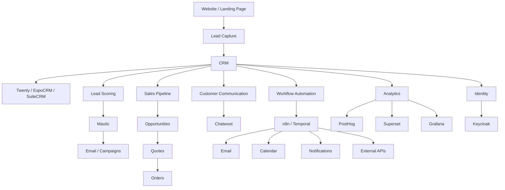
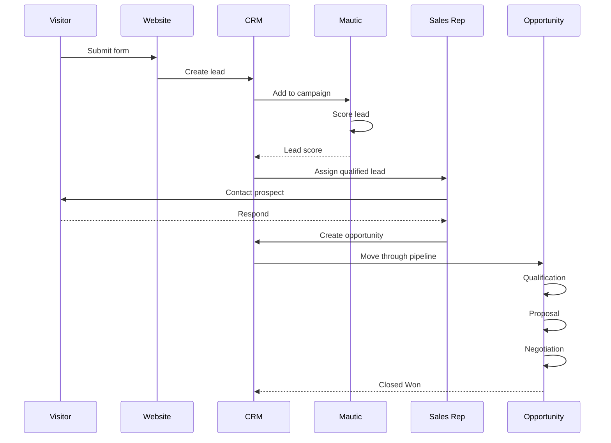
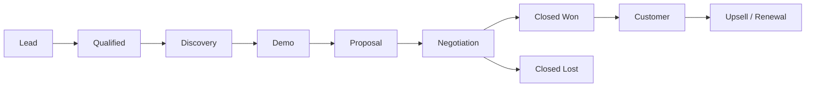
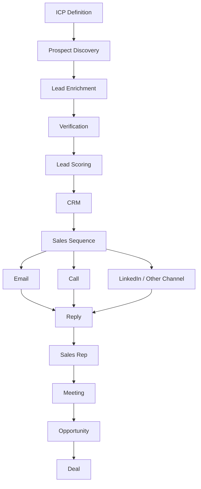
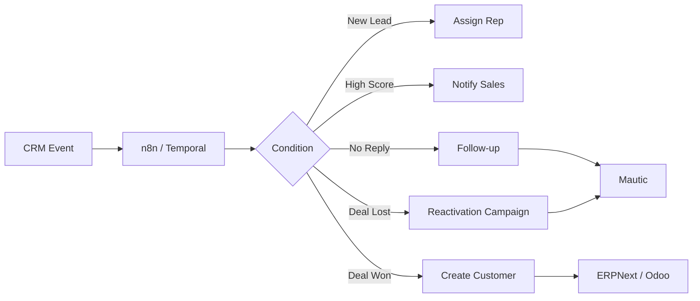
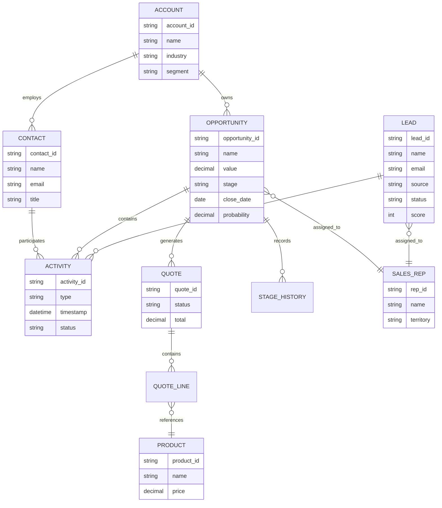
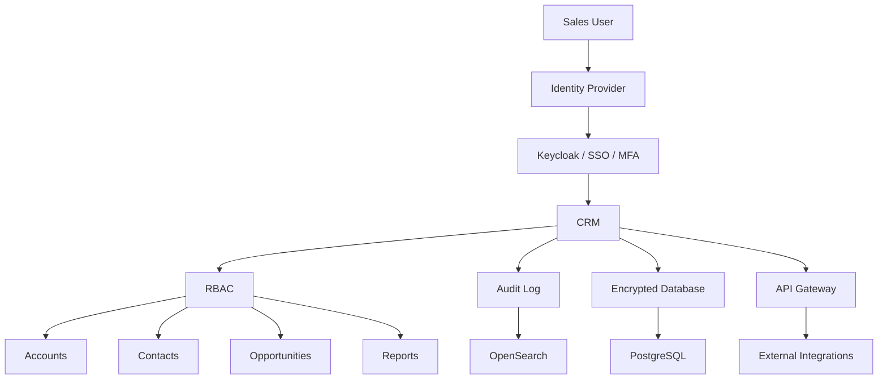

# Awesome-Sales

## Top Sales Platforms


A curated **GitHub-style reference list of Sales CRM, Sales Automation, Pipeline Management, Lead Management and Revenue Operations platforms**, covering commercial SaaS/hosted products and open-source/self-hosted alternatives.


The primary emphasis is on **open-source software that can be self-hosted**, while keeping commercial SaaS/hosted platforms in a separate section.


Modern sales platforms typically provide:


* Lead management

* Contact management

* Account / company management

* Opportunity management

* Sales pipelines

* Deal stages

* Activities and tasks

* Email integration

* Calendar integration

* Sales sequences

* Lead scoring

* Prospecting

* Sales automation

* Workflow automation

* Quotes and proposals

* Products and pricing

* Forecasting

* Territory management

* Sales reporting

* Dashboards

* Commission integration

* Customer communication

* Calling / telephony

* Marketing integration

* Customer support integration

* API / webhooks

* AI-assisted sales

* Data enrichment

* Revenue analytics

* Team collaboration


> **Important:** Salesforce, HubSpot Sales Hub and Microsoft Dynamics 365 Sales are much broader than a conventional CRM. A true enterprise sales platform combines CRM, automation, forecasting, reporting, communications, integrations, workflow engines and increasingly AI. Open-source alternatives are often strongest when assembled as a modular ecosystem rather than treated as a one-to-one replacement.


---


## Table of Contents


* [SaaS/Hosted Platforms](#saashosted-platforms)

* [Open-Source](#open-source)


  * [Full Open-Source Sales CRM](#full-open-source-sales-crm)

  * [Modern Developer-Friendly CRM](#modern-developer-friendly-crm)

  * [Enterprise CRM](#enterprise-crm)

  * [ERP + CRM](#erp--crm)

  * [Low-Code / Composable CRM](#low-code--composable-crm)

  * [Sales Automation & Outreach](#sales-automation--outreach)

  * [Marketing Automation](#marketing-automation)

  * [Customer Communication](#customer-communication)

  * [Lead Generation & Prospecting](#lead-generation--prospecting)

  * [Workflow Automation](#workflow-automation)

  * [Analytics & Revenue Intelligence](#analytics--revenue-intelligence)

  * [Identity & Infrastructure](#identity--infrastructure)

* [Commercial → Open-Source Mapping](#commercial--open-source-mapping)

* [Reference Architecture](#reference-architecture)

* [Lead-to-Customer Workflow](#lead-to-customer-workflow)

* [Sales Pipeline Workflow](#sales-pipeline-workflow)

* [Outbound Sales Workflow](#outbound-sales-workflow)

* [Sales Automation Workflow](#sales-automation-workflow)

* [Capability Matrix](#capability-matrix)

* [Recommended Open-Source Stacks](#recommended-open-source-stacks)

* [Best Open-Source Choices by Requirement](#best-open-source-choices-by-requirement)

* [What Open Source Can and Cannot Replace](#what-open-source-can-and-cannot-replace)

* [Why Open Source Is Attractive](#why-open-source-is-attractive)

* [Sales Data Model](#sales-data-model)

* [Security & Compliance Considerations](#security--compliance-considerations)

* [Important Licensing Considerations](#important-licensing-considerations)

* [Conclusion](#conclusion)

* [Contributing](#contributing)

* [Disclaimer](#disclaimer)


---


# SaaS/Hosted Platforms

> **Market Overview:** The global Sales CRM and Sales Technology software market is estimated at **$85+ Billion in 2026** (projected to surpass **$150 Billion by 2030** at ~12% CAGR). The sector is **moderately fragmented**: enterprise core CRM is relatively concentrated among mega-cap providers (Salesforce, Microsoft Dynamics, Oracle, SAP, and HubSpot controlling ~45-50% aggregated market share), whereas the sales engagement, outbound prospecting, and SMB pipeline management segments are highly fragmented across hundreds of specialized SaaS solutions and emerging open-source stacks.

These are **commercial platforms** and are deliberately kept separate from the open-source ecosystem, sorted in descending order by company scale (valuation / market capitalization and annual revenue).

| Platform | Primary Focus | Typical Strengths | Pricing | Free Tier / Trial Limit | Company Scale (Valuation / Revenue) |
| ------------------------------------------------------------------------------------------- | -------------------------------- | ----------------------------------------------------------- | --------------------------------------------------------------------------------------------------------- | -------------------------------------------------------------------------------------------------------------------------------- | ----------------------------------- |
| [Microsoft Dynamics 365 Sales](https://www.microsoft.com/en-us/dynamics-365/products/sales) | Enterprise CRM | Sales automation, Microsoft ecosystem, AI, forecasting | $65/user/month (Sales Professional, annual commitment) | 30-day free trial (requires work/school email; full access to Sales Professional features with sample data, extendable by 30 days) | ~$3.1T Market Cap / ~$245B Rev |
| [Oracle Sales](https://www.oracle.com/cx/sales/) | Enterprise Sales | CRM, sales automation, forecasting | $65/user/month (Professional Edition, billed annually, min 10 users) | 30-day sales-guided POC sandbox environment for qualified enterprise evaluations | ~$380B Market Cap / ~$53B Rev |
| [Oracle CX Sales](https://www.oracle.com/cx/sales/) | Enterprise Sales | Accounts, forecasting, sales automation | $65/user/month (Professional Edition, billed annually, min 10 users; $100/user/month for Enterprise) | 30-day sales-guided POC sandbox environment for qualified enterprise evaluations | ~$380B Market Cap / ~$53B Rev |
| [Salesforce Sales Cloud](https://www.salesforce.com/sales/cloud/) | Enterprise CRM / Sales | Accounts, opportunities, forecasting, automation, ecosystem | $25/user/month (Starter Suite, billed annually or monthly) | 30-day free trial (no credit card required; full access to Starter CRM features with pre-loaded sample data) | ~$270B Market Cap / ~$35B Rev |
| [SAP Sales Cloud](https://www.sap.com/products/crm/sales-cloud.html) | Enterprise CRM | Enterprise sales, accounts, forecasting, SAP integration | ~$60/user/month (Standard Edition, billed annually, enterprise multi-user agreement) | 30-day free trial (access to shared sandbox tenant with pre-configured sales scenarios and sample data) | ~$260B Market Cap / ~$35B Rev |
| [Adobe Sales / Marketo ecosystem](https://business.adobe.com/) | Marketing + Sales | Marketing automation and customer journeys | ~$895/month (Growth package, billed annually, up to 10,000 contacts and 10 users) | 7- to 14-day sales-guided interactive sandbox walkthrough & POC upon enterprise qualification | ~$210B Market Cap / ~$21B Rev |
| [HubSpot Sales Hub](https://www.hubspot.com/products/sales) | CRM / Sales Automation | Pipeline, sequences, email, automation, reporting | Free tier ($0); Starter from $15/seat/month (billed annually) or $20/seat/month (monthly) | Free forever plan for unlimited users (up to 1,000,000 contacts, 1 deal pipeline, 1 meeting link, 200 email tracking notifications/month); 14-day free trial for Professional | ~$33B Market Cap / ~$2.5B Rev |
| [Monday Sales CRM](https://monday.com/product/sales-crm) | Flexible Sales CRM | Pipelines, automation, dashboards | $12/seat/month (Basic CRM, billed annually, min 3 seats) or $15/seat/month (monthly); Standard from $17/seat/month | 14-day free trial (no credit card required; includes unlimited customizable pipelines, contacts, and Pro CRM features) | ~$13B Market Cap / ~$900M Rev |
| [Zendesk Sell](https://www.zendesk.com/sell/) | Sales CRM | Pipeline, prospecting, activities | $19/agent/month (Sell Team, billed annually) or $25/agent/month (monthly) | 14-day free trial (no credit card required; includes 2 customizable sales pipelines, call recording, and email tracking) | ~$10.2B Valuation (Acquired) / ~$1.7B Rev |
| [Zoho CRM](https://www.zoho.com/crm/) | CRM / Sales Automation | Leads, deals, workflows, AI, omnichannel sales | Free tier ($0); Standard from $14/user/month (billed annually) or $20/user/month (monthly) | Free forever for up to 3 users (up to 5,000 records, mobile app access, basic lead and deal management); 15-day free trial for paid editions | ~$10B+ Est. Valuation / ~$1.4B Rev |
| [Gong](https://www.gong.io/) | Revenue Intelligence | Conversation intelligence, forecasting, deal insights | ~$100–$116/user/month (~$1,200–$1,400/user/year) plus ~$5,000/year base platform fee (annual contract) | 14- to 30-day sales-guided pilot / POC evaluation (includes live meeting recordings, call transcription, and conversation analytics) | $7.25B Valuation (Series E) / ~$200M ARR |
| [Outreach](https://www.outreach.io/) | Sales Engagement | Sequences, engagement, forecasting, revenue workflows | ~$100/user/month (Amplify Essentials, billed annually, min seat requirements) | 14-day sales-assisted sandbox POC upon enterprise evaluation (access to multichannel sequences, AI assistant, and workflow automation) | $4.4B Valuation (Series G) / ~$200M ARR |
| [Freshsales](https://www.freshworks.com/crm/sales/) | Sales CRM | Lead scoring, email, pipeline, AI, automation | Free tier ($0); Growth from $9/user/month (billed annually) or $11/user/month (monthly) | Free forever for up to 3 users (includes 1 sales pipeline, contact lifecycle stages, built-in chat, email & phone); 21-day free trial for paid plans | ~$4.0B Market Cap / ~$700M Rev |
| [Clari](https://www.clari.com/) | Revenue Operations | Forecasting, pipeline inspection, revenue analytics | ~$100/user/month for base forecasting platform or ~$60/user/month for Clari Copilot (billed annually) | 14-day sales-assisted trial for Clari Copilot module (includes live call transcription and real-time conversation guidance) | $2.6B Valuation (Series F) / ~$100M ARR |
| [Salesloft](https://www.salesloft.com/) | Sales Engagement | Cadences, prospecting, conversations, revenue intelligence | ~$125/user/month (Essentials package, billed annually, typically 5–10 seat minimum) | 14-day guided proof-of-concept / sandbox trial via sales evaluation (access to cadences, dialer testing, and CRM integration) | $2.3B Valuation (Acquired) / ~$150M ARR |
| [Apollo.io](https://www.apollo.io/) | Prospecting / Sales Intelligence | Lead database, enrichment, sequencing, outbound | Free tier ($0); Basic from $49/user/month (billed annually) or $59/user/month (monthly) | Free forever with 10,000 email credits/month, 5 mobile number credits/month, 10 export credits/month, and 2 active sequences; 14-day free trial for paid plans | $1.6B Valuation (Series D) / ~$100M ARR |
| [Pipedrive](https://www.pipedrive.com/) | Sales CRM | Visual pipeline, activities, deal management, automation | $14/user/month (Lite plan, billed annually) or $24/user/month (monthly) | 14-day free trial (no credit card required; full access to customizable pipelines, activity tracking, and deal management) | $1.5B Valuation (Acquired) / ~$150M ARR |
| [Creatio](https://www.creatio.com/) | CRM / No-Code Automation | Sales automation and process management | $25/user/month (Sales Starter, billed annually) or $40/user/month (Growth plan) | Free forever for Studio Free (process modeling & documentation); 14-day free trial for CRM Sales Growth (no credit card required, full access to no-code workflows) | $1.2B Valuation (Unicorn) / ~$100M ARR |
| [LeadSquared](https://www.leadsquared.com/) | Sales CRM | Lead capture, scoring, automation, field sales | $25/user/month (Lite plan, billed annually) | 15-day free trial (no credit card required; includes lead capture, activity tracking, task management, and core workflows) | $1.0B Valuation (Series C Unicorn) / ~$50M ARR |
| [SugarCRM](https://www.sugarcrm.com/) | CRM | Sales automation, forecasting, account management | $19/user/month (Sell Essentials, billed annually, min 3 users) or $49/user/month (Sell Advanced) | 7-day free trial (no credit card required; includes sample data, pipeline tracking, reporting, and dashboard access) | ~$600M Est. Valuation / ~$100M ARR |
| [Keap](https://keap.com/) | CRM / Automation | Small-business sales and marketing automation | $249/month (Ignite, billed annually; $299 monthly) for 2 users and 1,500 contacts ($29/user/month for additional users) | 14-day free trial (no credit card required; includes 1,500 contacts, CRM, and sales & marketing automation builder) | ~$500M Est. Valuation / ~$100M ARR |
| [Copper CRM](https://www.copper.com/) | Google Workspace CRM | Gmail/Calendar integration, pipeline | $9/user/month (Starter, billed annually) or $12/user/month (monthly); Standard from $25/user/month | 14-day free trial (no credit card required; includes Google Workspace integration, visual pipelines, and contact history) | ~$350M Est. Valuation / ~$40M ARR |
| [Insightly](https://www.insightly.com/) | CRM / Project-linked Sales | Opportunities, projects, workflow automation | $29/user/month (Plus plan, billed annually) or $35/user/month (monthly) | 14-day free trial (no credit card required; includes up to 2,500 records, 500 mass emails/day, and project management) | ~$180M Est. Valuation / ~$30M ARR |
| [Lemlist](https://www.lemlist.com/) | Sales Outreach | Personalized outbound, multichannel campaigns | Free plan ($0); Email Starter from $39/user/month (billed annually) or $69/user/month (monthly) | Free forever plan with 100 email & 25 phone number lead exports/month (campaign sending locked); 14-day free trial on paid plans (full campaign sending & warmup) | ~$150M Est. Valuation / ~$30M ARR |
| [Instantly](https://instantly.ai/) | Cold Email | Email campaigns, inbox management, automation | $30/month (Growth, billed annually) or $47/month (monthly) | 14-day free trial (no credit card required; includes unlimited email account connections, up to 1,000 active contacts, and automated warmup) | ~$120M Est. Valuation / ~$20M ARR |
| [Close](https://close.com/) | Sales CRM / Calling | Calling, email, SMS, pipelines, sequences | $9/user/month (Solo, billed annually) or $19/user/month (monthly); Essentials from $35/user/month | 14-day free trial (no credit card required; full access to calling, email sequences, SMS, and built-in AI trial credits) | ~$80M Est. Valuation / ~$15M ARR |
| [Reply.io](https://reply.io/) | Sales Engagement | Multichannel outreach, sequences, automation | $49/user/month (Email Volume, billed annually) or $59/user/month (monthly); Multichannel from $89/user/month | 14-day free trial (no credit card required; includes 200 data finder credits, email sequencing, and basic automation testing) | ~$70M Est. Valuation / ~$15M ARR |
| [Nimble](https://www.nimble.com/) | Relationship CRM | Contact enrichment, social selling, email | $24.90/user/month (billed annually) or $29.90/user/month (monthly) | 14-day free trial (no credit card required; includes up to 25,000 contact records, social profile enrichment, and unified inbox) | ~$45M Est. Valuation / ~$10M ARR |
| [Nutshell](https://www.nutshell.com/) | Sales CRM | Pipeline, email, reporting, automation | $7/user/month (Foundation, billed annually) or $13/user/month (monthly); Growth from $16/user/month | 14-day free trial (no credit card required; full access to contact management, pipelines, and email templates) | ~$40M Est. Valuation / ~$10M ARR |
| [Outplay](https://outplayhq.com/) | Sales Engagement | Multichannel sequences, email, calling, LinkedIn | Free tier ($0); Starter from $39/month (billed annually) or $49/month (monthly) | Free forever for 1 user (up to 2,000 active prospects/month, 5,000 prospect storage, 2 connected mailboxes, manual outreach); 7-day free trial for paid plans | ~$35M Est. Valuation / ~$5M ARR |
| [Saleshandy](https://www.saleshandy.com/) | Cold Outreach | Email campaigns, sequences, lead management | $25/month (Outreach Starter, billed annually) or $36/month (monthly) | 7-day free trial (no credit card required; includes up to 2,000 emails/month, unlimited email accounts, and automated email warmup) | ~$30M Est. Valuation / ~$8M ARR |
| [Less Annoying CRM](https://www.lessannoyingcrm.com/) | SMB CRM | Contacts, pipeline, tasks, simple sales management | $15/user/month (flat rate, all features included) | 30-day free trial (no credit card required; unlimited contacts, companies, pipelines, tasks, and full support) | ~$20M Est. Valuation / ~$4M ARR |

---


# Commercial Platform Categories


```text id="q1m3w8"

Enterprise CRM

├── Salesforce Sales Cloud

├── Microsoft Dynamics 365 Sales

├── Oracle Sales

├── SAP Sales Cloud

└── Zoho CRM


SMB / Mid-Market Sales CRM

├── HubSpot Sales Hub

├── Pipedrive

├── Freshsales

├── Close

├── Copper

└── Nutshell


Sales Engagement

├── Salesloft

├── Outreach

├── Reply.io

├── Outplay

└── Lemlist


Sales Intelligence / Prospecting

├── Apollo.io

├── Gong

├── Clari

└── LeadSquared

```


---


# Open-Source


The open-source sales ecosystem is considerably more fragmented than the commercial CRM market.


A complete open-source sales platform can be assembled from:


```text id="j2p8mk"

CRM

  +

Sales Pipeline

  +

Email

  +

Sales Engagement

  +

Marketing Automation

  +

Lead Generation

  +

Workflow Automation

  +

Analytics

  +

Identity

```


The strongest projects range from complete CRM applications to highly specialized sales infrastructure.


---


# Full Open-Source Sales CRM


# 1. Twenty


https://github.com/twentyhq/twenty


https://twenty.com/


**Twenty is one of the most interesting modern open-source alternatives to Salesforce, HubSpot and Pipedrive.**


Twenty describes itself as a modern open-source CRM designed to give technical teams building blocks for a customizable CRM that can be treated more like software than a fixed SaaS application. ([github.com](https://github.com/twentyhq/twenty?utm_source=chatgpt.com))


### Features


* Companies

* People

* Leads

* Opportunities

* Pipelines

* Tasks

* Notes

* Activities

* Custom objects

* Custom fields

* Views

* Workflows

* API

* Webhooks

* Integrations

* Self-hosting

* Developer customization

* Modern web UI


### Best for


```text id="w5t3m9"

Pipedrive

   +

Modern HubSpot CRM

   +

Developer-first Salesforce alternative

```


### Particularly interesting


Twenty's architecture is designed around customizable objects and developer-oriented extensibility, making it attractive for organizations that want CRM functionality without accepting a rigid data model. ([github.com](https://github.com/twentyhq/twenty?utm_source=chatgpt.com))


---


# 2. EspoCRM


https://github.com/espocrm/espocrm


https://www.espocrm.com/


EspoCRM is a mature open-source CRM covering leads, contacts, accounts, opportunities, campaigns, cases, workflows and reporting.


The project describes itself as a free, open-source CRM and provides a REST API, web interface, lead/opportunity management, campaigns and support functionality. ([github.com](https://github.com/espocrm/espocrm?utm_source=chatgpt.com))


### Features


* Leads

* Contacts

* Accounts

* Opportunities

* Sales pipelines

* Activities

* Emails

* Calendars

* Campaigns

* Workflows

* Reports

* Dashboards

* Quotes

* Products

* Teams

* Roles

* REST API

* Custom entities

* Custom fields

* Portal functionality


### Best for


```text id="4gq0n2"

HubSpot Sales

   +

Pipedrive

   +

SMB / Mid-market CRM

```


EspoCRM is licensed under AGPLv3. ([github.com](https://github.com/espocrm/espocrm?utm_source=chatgpt.com))


---


# 3. SuiteCRM


https://github.com/SuiteCRM/SuiteCRM


https://suitecrm.com/


SuiteCRM is one of the most established open-source enterprise CRM projects.


The project describes SuiteCRM as an open-source enterprise-ready CRM, with a mature 7.x branch and a newer SuiteCRM 8 architecture. ([github.com](https://github.com/SuiteCRM/SuiteCRM?utm_source=chatgpt.com))


### Features


* Leads

* Contacts

* Accounts

* Opportunities

* Quotes

* Products

* Contracts

* Forecasting

* Reports

* Dashboards

* Workflow

* Documents

* Cases

* Campaigns

* Multi-currency

* Multi-language

* Portal

* API

* Custom modules


### Best for


```text id="6t5fzy"

Salesforce Sales Cloud

```


SuiteCRM is published under AGPLv3. ([github.com](https://github.com/SuiteCRM/SuiteCRM?utm_source=chatgpt.com))


---


# 4. Frappe CRM


https://github.com/frappe/crm


https://frappecrm.com/


Frappe CRM is a modern open-source CRM built on the Frappe framework.


### Features


* Leads

* Deals

* Contacts

* Organizations

* Sales pipeline

* Communication

* Tasks

* Notes

* Assignment

* REST API

* Customization

* Frappe ecosystem integration


### Best for


```text id="i4w8cx"

Modern lightweight sales CRM

+

ERPNext ecosystem

```


---


# 5. ERPNext CRM


https://github.com/frappe/erpnext


https://erpnext.com/


ERPNext is a complete ERP platform with a substantial CRM and sales module.


### Features


* Leads

* Opportunities

* Customers

* Quotations

* Sales orders

* Products

* Pricing

* Sales teams

* Territories

* Campaigns

* Activities

* Communication

* Sales analytics

* Accounting integration

* Inventory integration

* Manufacturing integration


### Best for


```text id="7h8b4m"

CRM

+

ERP

+

Inventory

+

Accounting

+

Sales

```


This makes ERPNext particularly powerful for product businesses where the sales process needs to flow directly into quotations, orders, inventory and finance.


---


# 6. Odoo CRM


https://github.com/odoo/odoo


https://www.odoo.com/


Odoo combines CRM with a large ERP/application ecosystem.


### Features


* Leads

* Opportunities

* Pipeline

* Activities

* Email

* Calendar

* Sales teams

* Forecasting

* Quotations

* Products

* Orders

* Invoicing

* Inventory

* Marketing automation

* Website

* Helpdesk


### Best for


```text id="5epv9y"

Salesforce

+

ERP

+

E-commerce

+

Operations

```


The Community edition provides an open-source core, while Odoo's overall product includes proprietary/enterprise components, so edition-specific licensing should be checked.


---


# 7. Vtiger CRM


https://github.com/vtigercrm/vtigercrm


https://www.vtiger.com/


Vtiger is a long-running CRM project with an open-source codebase and commercial offerings.


### Features


* Leads

* Contacts

* Organizations

* Opportunities

* Products

* Quotes

* Sales orders

* Invoices

* Campaigns

* Helpdesk

* Workflow

* Reporting


### Best for


```text id="17d7yr"

Traditional CRM

+

Sales

+

Support

```


> Check the current licensing and edition structure carefully before treating the current Vtiger ecosystem as equivalent to a fully unrestricted open-source product.


---


# 8. YetiForce


https://github.com/YetiForceCompany/YetiForceCRM


https://yetiforce.com/


YetiForce is a feature-rich open-source CRM/ERP-oriented platform derived historically from the SugarCRM/Vtiger ecosystem.


### Features


* Sales

* Leads

* Contacts

* Accounts

* Opportunities

* Products

* Quotes

* Invoices

* Projects

* Workflows

* Reporting

* Inventory-related functionality

* Customer portal


### Best for


```text id="q7g7h5"

Large customizable CRM

+

ERP-style workflows

```


---


# 9. Dolibarr


https://github.com/Dolibarr/dolibarr


https://www.dolibarr.org/


Dolibarr is an open-source ERP and CRM suite.


### CRM capabilities


* Prospects

* Customers

* Contacts

* Opportunities

* Proposals

* Orders

* Products

* Invoices

* Payments

* Projects

* Commercial actions

* Reporting


### Best for


```text id="9m0d4k"

SMB CRM

+

ERP

+

Sales

```


---


# 10. Axelor


https://github.com/axelor/axelor-open-suite


https://www.axelor.com/


Axelor Open Suite provides open-source business applications including CRM, sales, ERP and workflow management.


### Useful for


* Leads

* Opportunities

* Customers

* Quotes

* Orders

* Sales workflows

* ERP

* Business process automation


---


# Enterprise CRM


# 11. Corteza


https://github.com/cortezaproject/corteza


https://www.cortezaproject.org/


Corteza is an open-source low-code platform that can be used to build CRM applications and custom business systems.


### Features


* Low-code application development

* Custom objects

* Workflows

* APIs

* Permissions

* Automation

* Dashboards

* Data models


### Best for


```text id="y4g1g7"

Salesforce Platform

+

Custom CRM

+

Low-code development

```


---


# 12. OroCRM


https://github.com/oroinc/crm


https://oroinc.com/


OroCRM is an open-source CRM platform focused heavily on B2B sales and customer management.


### Features


* Accounts

* Contacts

* Leads

* Opportunities

* Sales pipelines

* Activities

* Customer data

* Reporting

* Workflow

* B2B sales


### Best for


```text id="5d2vpl"

B2B CRM

+

Complex account structures

+

Sales workflows

```


---


# 13. CiviCRM


https://github.com/civicrm/civicrm-core


https://civicrm.org/


CiviCRM is an open-source constituent relationship management platform.


It is particularly useful for:


* Nonprofits

* Associations

* Membership organizations

* Fundraising

* Donor management


### Not a direct Salesforce Sales Cloud replacement


It is better understood as:


```text id="d4g3hv"

Relationship Management

+

Constituents

+

Fundraising

+

Campaigns

```


---


# 14. Monica


https://github.com/monicahq/monica


https://www.monicahq.com/


Open-source personal relationship management platform.


### Useful for


* Contacts

* Relationship history

* Reminders

* Notes

* Activities


### Best for


Personal CRM rather than enterprise sales automation.


---


# Low-Code / Composable CRM


# 15. NocoDB


https://github.com/nocodb/nocodb


https://nocodb.com/


Open-source Airtable-like platform that can be used as a lightweight composable CRM backend.


### Useful for


* Leads

* Contacts

* Opportunities

* Custom sales databases

* Views

* Automations

* APIs


---


# 16. Baserow


https://github.com/baserow/baserow


https://baserow.io/


Open-source database/spreadsheet platform suitable for building lightweight sales applications.


### Example


```text id="qj3h4d"

Baserow

   │

   ├── Leads

   ├── Accounts

   ├── Opportunities

   ├── Activities

   └── Sales Dashboard

```


---


# 17. Appsmith


https://github.com/appsmithorg/appsmith


Open-source internal application builder.


### Useful for


* Sales dashboards

* Lead-management interfaces

* Approval workflows

* CRM extensions

* Internal sales tools


---


# 18. Budibase


https://github.com/Budibase/budibase


Open-source low-code application platform.


### Useful for


* Sales operations

* Internal CRM

* Lead workflows

* Approval systems

* Custom dashboards


---


# 19. ToolJet


https://github.com/ToolJet/ToolJet


Open-source internal application development platform.


Useful for building:


* Sales dashboards

* CRM interfaces

* Deal review tools

* Lead-management applications


---


# Sales Automation & Outreach


A major weakness of many open-source CRMs is that **sales engagement** is less mature than in Salesloft, Outreach or Apollo.


The following projects can fill that gap.


---


# 20. Mautic


https://github.com/mautic/mautic


https://www.mautic.org/


Mautic is one of the most important open-source marketing-automation platforms.


### Features


* Lead capture

* Lead scoring

* Segmentation

* Email campaigns

* Campaign automation

* Forms

* Landing pages

* Tracking

* Personalization

* Webhooks

* CRM integrations


### Best for


```text id="4v4k1c"

HubSpot Marketing

+

Lead Nurturing

+

Lead Scoring

```


---


# 21. Listmonk


https://github.com/knadh/listmonk


https://listmonk.app/


High-performance open-source newsletter and mailing-list manager.


### Useful for


* Email campaigns

* Segmentation

* Subscriber management

* Transactional campaigns

* Sales nurturing


---


# 22. Keila


https://github.com/pentacent/keila


Open-source email marketing platform.


### Useful for


* Campaigns

* Mailing lists

* Segmentation

* Email analytics


---


# 23. Mautic + CRM


A powerful open-source sales stack can combine:


```text id="5ty8in"

CRM

  │

  ▼

Mautic

  │

  ├── Lead Scoring

  ├── Email

  ├── Campaigns

  └── Nurturing

```


---


# Customer Communication


# 24. Chatwoot


https://github.com/chatwoot/chatwoot


https://www.chatwoot.com/


Open-source customer engagement platform.


### Features


* Live chat

* Email

* Social channels

* Shared inbox

* Customer profiles

* Automation

* Team assignment

* API

* Helpdesk functionality


### Best for


```text id="n7ecq5"

HubSpot Conversations

+

Customer Engagement

+

Support

```


---


# 25. Papercups


https://github.com/papercups-io/papercups


Open-source customer communication platform.


### Useful for


* Live chat

* Customer messaging

* Support

* Sales conversations


---


# 26. Zammad


https://github.com/zammad/zammad


https://zammad.org/


Open-source helpdesk/customer-support platform.


### Useful for


* Customer communication

* Email

* Tickets

* Customer history

* Support-to-sales handoff


---


# Lead Generation & Prospecting


There is no single open-source project that completely reproduces Apollo.io's combination of:


```text

Lead Database

+

Email Discovery

+

Enrichment

+

Intent

+

Sequencing

```


A modular architecture is usually more realistic.


---


# 27. OpenLeads


https://github.com/Samyrrrrrr990/openleads


An open-source prospecting/lead-generation project designed around discovering public lead information and outreach workflows.


### Useful for


* Prospect discovery

* Lead generation

* Email discovery

* Public-data research

* Outreach


---


# 28. OpenProspector


https://github.com/clawnify/OpenProspector


Open-source lead-enrichment/prospecting application.


### Useful for


* Lead discovery

* Enrichment

* Provider integrations

* Prospect workflows


---


# 29. OpenGTM


https://github.com/buildingopen/opengtm


Open-source GTM platform aimed at combining:


* Lead generation

* ICP analysis

* Outreach

* Sales workflows

* AI-assisted GTM


---


# 30. LeadPipeline


https://github.com/AI-Invention/lead-pipeline


Open-source sales/lead-generation workflow.


### Concept


```text id="y7q2kx"

Discover

   ↓

Enrich

   ↓

Qualify

   ↓

Pitch

   ↓

Demo

   ↓

Close

```


---


# 31. KeeLead


https://github.com/Atum246/keelead


Open-source AI-assisted lead-generation and research platform.


### Useful for


* Lead discovery

* Company research

* Email verification

* Lead enrichment

* Sales research


---


# 32. Lead Research Agent


https://github.com/mcvalosborne/lead-research-agent


Open-source AI-assisted lead discovery and research workflow.


---


# 33. theHarvester


https://github.com/laramies/theHarvester


OSINT tool for discovering publicly available information associated with domains.


### Useful for


* Prospect research

* Company research

* Domain discovery


> Use only for legitimate, lawful research and respect applicable privacy and website terms.


---


# Workflow Automation


# 34. n8n


https://github.com/n8n-io/n8n


https://n8n.io/


One of the most useful open-source workflow engines for constructing sales automation.


### Example


```text id="j4o2jz"

New Lead

   ↓

n8n

   ├── Enrich

   ├── Score

   ├── Create CRM Record

   ├── Send Email

   ├── Notify Sales Rep

   └── Schedule Follow-up

```


---


# 35. Node-RED


https://github.com/node-red/node-red


Flow-based automation platform.


Useful for connecting:


* CRM

* Email

* APIs

* Webhooks

* Databases

* Notifications


---


# 36. Windmill


https://github.com/windmill-labs/windmill


Open-source workflow and automation platform.


### Useful for


* Sales operations

* Data enrichment

* Scheduled jobs

* API automation

* CRM synchronization


---


# 37. Temporal


https://github.com/temporalio/temporal


Durable workflow orchestration.


### Best for


* Long-running sales processes

* Automated follow-ups

* Deal workflows

* Approval processes

* Reliable retries


---


# Analytics & Revenue Intelligence


# 38. Apache Superset


https://github.com/apache/superset


Open-source BI platform.


### Useful for


* Pipeline dashboards

* Conversion rates

* Sales velocity

* Revenue

* Win/loss

* Rep performance

* Forecasting


---


# 39. Metabase


https://github.com/metabase/metabase


Self-service analytics platform.


---


# 40. Grafana


https://github.com/grafana/grafana


Useful for operational sales dashboards and real-time metrics.


---


# 41. PostHog


https://github.com/PostHog/posthog


Open-source product analytics platform.


### Useful for


* Product usage

* Lead behavior

* Conversion

* Funnel analytics

* Customer journeys


This is especially valuable for SaaS companies where sales and product signals need to be combined.


---


# 42. Matomo


https://github.com/matomo-org/matomo


Open-source web analytics.


Useful for:


* Website lead attribution

* Campaign analytics

* Conversion tracking

* Visitor behavior


---


# Identity & Infrastructure


# 43. Keycloak


https://github.com/keycloak/keycloak


https://www.keycloak.org/


Open-source IAM platform.


### Features


* SSO

* OIDC

* OAuth 2.0

* SAML

* LDAP

* Active Directory

* MFA

* Roles

* Groups


---


# 44. PostgreSQL


https://github.com/postgres/postgres


A strong open-source relational database for CRM systems.


---


# 45. Redis


https://github.com/redis/redis


Useful for:


* Caching

* Queues

* Rate limiting

* Session state

* Real-time sales applications


---


# Commercial → Open-Source Mapping


| Commercial Platform          | Closest Open-Source Direction                         |

| ---------------------------- | ----------------------------------------------------- |

| Salesforce Sales Cloud       | **SuiteCRM / Twenty / EspoCRM**                       |

| HubSpot Sales Hub            | **EspoCRM / Twenty + Mautic + Chatwoot**              |

| Microsoft Dynamics 365 Sales | **ERPNext / Odoo / SuiteCRM**                         |

| Pipedrive                    | **Twenty / EspoCRM / Frappe CRM**                     |

| Zoho CRM                     | **EspoCRM / ERPNext / Odoo**                          |

| Freshsales                   | **EspoCRM / Twenty / Frappe CRM**                     |

| Close                        | **EspoCRM + Chatwoot + telephony integration**        |

| Salesloft                    | **Mautic + CRM + n8n**                                |

| Outreach                     | **Mautic + CRM + n8n / Temporal**                     |

| Apollo.io                    | **Open-source CRM + OpenLeads + enrichment + Mautic** |

| Gong                         | **PostHog + CRM + open-source speech/LLM stack**      |

| Clari                        | **CRM + Superset / Metabase + forecasting models**    |

| LeadSquared                  | **EspoCRM / Frappe CRM + Mautic**                     |

| SugarCRM                     | **SuiteCRM / EspoCRM**                                |

| Creatio                      | **Corteza + n8n + CRM**                               |

| Copper CRM                   | **Twenty / EspoCRM**                                  |

| Zendesk Sell                 | **EspoCRM + Chatwoot**                                |

| Monday Sales CRM             | **Twenty / Baserow / NocoDB**                         |

| CRM + ERP                    | **ERPNext / Odoo / Dolibarr**                         |


---


# Reference Architecture


A serious open-source sales platform can be assembled as follows:





---


# Lead-to-Customer Workflow





---


# Sales Pipeline Workflow





---


# Outbound Sales Workflow





---


# Sales Automation Workflow





---


# Sales Engagement Architecture


```text id="5a6g2r"

                     CRM

                      │

          ┌───────────┼────────────┐

          ▼           ▼            ▼

       Leads       Contacts      Deals

          │

          ▼

       Mautic

          │

     ┌────┼─────┐

     ▼    ▼     ▼

   Email SMS   Web

     │

     ▼

  Engagement

     │

     ▼

   Scoring

     │

     ▼

    CRM

     │

     ▼

   Sales Rep

```


---


# Capability Matrix


| Capability           |    Salesforce |       HubSpot |    Pipedrive |      Zoho |       Twenty |           EspoCRM |     SuiteCRM |    ERPNext |       Odoo |

| -------------------- | ------------: | ------------: | -----------: | --------: | -----------: | ----------------: | -----------: | ---------: | ---------: |

| Leads                |             ✅ |             ✅ |            ✅ |         ✅ |            ✅ |                 ✅ |            ✅ |          ✅ |          ✅ |

| Contacts             |             ✅ |             ✅ |            ✅ |         ✅ |            ✅ |                 ✅ |            ✅ |          ✅ |          ✅ |

| Accounts             |             ✅ |             ✅ |            ✅ |         ✅ |            ✅ |                 ✅ |            ✅ |          ✅ |          ✅ |

| Opportunities        |             ✅ |             ✅ |            ✅ |         ✅ |            ✅ |                 ✅ |            ✅ |          ✅ |          ✅ |

| Sales pipeline       |             ✅ |             ✅ |            ✅ |         ✅ |            ✅ |                 ✅ |            ✅ |          ✅ |          ✅ |

| Activities           |             ✅ |             ✅ |            ✅ |         ✅ |            ✅ |                 ✅ |            ✅ |          ✅ |          ✅ |

| Email integration    |             ✅ |             ✅ |            ✅ |         ✅ |            ✅ |                 ✅ |            ✅ |          ✅ |          ✅ |

| Calendar             |             ✅ |             ✅ |            ✅ |         ✅ |            ✅ |                 ✅ |            ✅ |          ✅ |          ✅ |

| Workflow automation  |             ✅ |             ✅ |            ✅ |         ✅ |            ✅ |                 ✅ |            ✅ |          ✅ |          ✅ |

| Sales sequences      |             ✅ |             ✅ |            ✅ |         ✅ |      Partial | Partial/extension |      Partial |    Partial |    Partial |

| Lead scoring         |             ✅ |             ✅ |            ✅ |         ✅ |      Partial |           Partial |      Partial |    Partial |    Partial |

| Marketing automation |             ✅ |         **✅** |      Partial |     **✅** |            ❌ |           Partial |      Partial |    Partial |      **✅** |

| Quotes               |             ✅ |             ✅ |            ✅ |         ✅ |      Partial |                 ✅ |            ✅ |      **✅** |      **✅** |

| Products             |             ✅ |             ✅ |            ✅ |         ✅ |      Partial |                 ✅ |            ✅ |      **✅** |      **✅** |

| Sales orders         |             ✅ |       Partial |      Partial |         ✅ |            ❌ |           Partial |      Partial |      **✅** |      **✅** |

| ERP integration      | Via ecosystem | Via ecosystem | Integrations | Ecosystem | Integrations |      Integrations | Integrations | **Native** | **Native** |

| Custom objects       |         **✅** |             ✅ |      Partial |         ✅ |        **✅** |             **✅** |        **✅** |      **✅** |      **✅** |

| REST API             |         **✅** |         **✅** |        **✅** |     **✅** |        **✅** |             **✅** |        **✅** |      **✅** |      **✅** |

| Self-hosted          |             ❌ |             ❌ |            ❌ |         ❌ |        **✅** |             **✅** |        **✅** |      **✅** |      **✅** |

| Open source          |             ❌ |             ❌ |            ❌ |         ❌ |        **✅** |             **✅** |        **✅** |     **✅*** |     **✅*** |


`*` Edition and component licensing varies; verify the exact version and module before deployment.


---


# Recommended Open-Source Stacks


# 1. Best Modern CRM Stack


```text id="3t5xkj"

Twenty

   +

PostgreSQL

   +

Keycloak

   +

n8n

   +

Mautic

   +

Chatwoot

   +

Superset

```


### Best for


* Startups

* SaaS companies

* Technical sales teams

* Modern CRM UX

* Custom CRM development


---


# 2. Best Mature Sales CRM Stack


```text id="8xv1z2"

EspoCRM

   +

PostgreSQL

   +

Keycloak

   +

n8n

   +

Mautic

   +

Chatwoot

   +

Metabase

```


### Best for


```text id="9i7w0d"

HubSpot-style CRM

+

Sales automation

+

Lead nurturing

+

Customer communication

```


---


# 3. Best Salesforce Alternative


```text id="h3xj8a"

SuiteCRM

   +

PostgreSQL / MariaDB

   +

Keycloak

   +

n8n

   +

Mautic

   +

Superset

```


### Best for


* Enterprise CRM

* Complex data models

* Custom modules

* Large sales teams

* Self-hosted deployments


SuiteCRM is explicitly positioned as an enterprise-ready open-source CRM and remains one of the more mature open-source Salesforce alternatives. ([github.com](https://github.com/SuiteCRM/SuiteCRM?utm_source=chatgpt.com))


---


# 4. Best CRM + ERP Stack


```text id="q9x0vn"

ERPNext

   +

Frappe CRM

   +

PostgreSQL / MariaDB

   +

n8n

   +

Mautic

   +

Superset

```


### Best for


```text id="xq5h6y"

Sales

+

Quotations

+

Orders

+

Inventory

+

Accounting

```


---


# 5. Best Odoo-Style Business Stack


```text id="5y8n8g"

Odoo Community

   +

CRM

   +

Sales

   +

Inventory

   +

Accounting

   +

Website

   +

Marketing

```


### Best for


Companies wanting CRM embedded directly inside a broad business-management suite.


---


# 6. Best HubSpot-Style Open-Source Stack


```text id="7k8f2m"

Twenty / EspoCRM

        +

Mautic

        +

Chatwoot

        +

n8n

        +

PostHog

        +

Superset

```


### Functional mapping


```text id="r5v3h7"

CRM

   ↓

Twenty / EspoCRM


Marketing Automation

   ↓

Mautic


Conversations

   ↓

Chatwoot


Automation

   ↓

n8n


Product Analytics

   ↓

PostHog


Business Analytics

   ↓

Superset

```


---


# 7. Best Pipedrive Alternative


```text id="f8c5sw"

Twenty

   +

PostgreSQL

   +

n8n

```


or:


```text id="1g0m4j"

Frappe CRM

   +

n8n

```


The emphasis should be:


```text

Contacts

   ↓

Deals

   ↓

Pipeline

   ↓

Activities

   ↓

Follow-ups

   ↓

Won/Lost

```


---


# 8. Best Apollo.io Open-Source Architecture


Apollo combines several products that are usually separate in open source.


A realistic architecture is:


```text id="7q5b3n"

                    Prospect Discovery

                           │

          ┌────────────────┼────────────────┐

          ▼                ▼                ▼

      OpenLeads       OpenProspector     OSINT

          │                │                │

          └────────────────┼────────────────┘

                           ▼

                       Enrichment

                           │

                           ▼

                         CRM

                  Twenty / EspoCRM

                           │

                           ▼

                       Mautic

                           │

                     ┌─────┼─────┐

                     ▼     ▼     ▼

                   Email  SMS   Web

                           │

                           ▼

                         n8n

```


### Important


Apollo's proprietary advantage comes partly from its large proprietary contact database, enrichment infrastructure and integrated workflow.


Open-source software can reproduce the **workflow**, but not automatically provide an equivalent proprietary contact database.


---


# 9. Best Salesloft / Outreach Alternative


```text id="1u5r7a"

CRM

 │

 ▼

Mautic

 │

 ├── Email sequences

 ├── Lead nurturing

 ├── Scoring

 └── Campaign automation

 │

 ▼

n8n

 │

 ├── CRM events

 ├── Follow-ups

 ├── Notifications

 └── API integrations

```


Add:


```text

Chatwoot

+

telephony provider

+

calendar integration

```


for a more complete sales-engagement environment.


---


# 10. Full Open-Source Sales Platform


```text id="9m6t2v"

                         ┌─────────────────┐

                         │    Keycloak     │

                         │ SSO / MFA / IAM │

                         └────────┬────────┘

                                  │

                                  ▼

                         ┌─────────────────┐

                         │      CRM        │

                         │ Twenty / Espo   │

                         └────────┬────────┘

                                  │

          ┌───────────────────────┼──────────────────────┐

          ▼                       ▼                      ▼

      Mautic                   Chatwoot                n8n

      Marketing              Conversations          Automation

          │                       │                      │

          └───────────────────────┼──────────────────────┘

                                  │

                                  ▼

                              PostHog

                              Analytics

                                  │

                                  ▼

                             Superset

                             Reporting

                                  │

                                  ▼

                              PostgreSQL

```


---


# Best Open-Source Choices by Requirement


| Requirement                                 | Recommended OSS                  |

| ------------------------------------------- | -------------------------------- |

| Best modern CRM                             | **Twenty**                       |

| Best mature CRM                             | **EspoCRM**                      |

| Best enterprise CRM                         | **SuiteCRM**                     |

| Best CRM + ERP                              | **ERPNext / Odoo**               |

| Best modern ERP-linked CRM                  | **Frappe CRM**                   |

| Best customizable low-code CRM              | **Corteza**                      |

| Best B2B CRM                                | **OroCRM**                       |

| Best lightweight CRM                        | **Twenty / EspoCRM**             |

| Best personal CRM                           | **Monica**                       |

| Best marketing automation                   | **Mautic**                       |

| Best open-source customer communication     | **Chatwoot**                     |

| Best workflow automation                    | **n8n**                          |

| Best durable workflow                       | **Temporal**                     |

| Best lead database replacement architecture | **OpenLeads + enrichment stack** |

| Best sales analytics                        | **Superset / Metabase**          |

| Best product analytics                      | **PostHog**                      |

| Best web analytics                          | **Matomo**                       |

| Best IAM                                    | **Keycloak**                     |

| Best CRM database                           | **PostgreSQL**                   |


---


# What Open Source Can and Cannot Replace


## Can Replace


Open-source software can reproduce many core sales capabilities:


* Contact management

* Account management

* Lead management

* Opportunity management

* Deal pipelines

* Activities

* Tasks

* Notes

* Email integration

* Calendar integration

* Workflow automation

* Lead scoring

* Marketing automation

* Customer communication

* Sales dashboards

* Reporting

* Quotes

* Products

* Orders

* ERP integration

* APIs

* Webhooks

* Custom objects

* Self-hosting


---


# More Difficult to Reproduce


## 1. Proprietary Lead Databases


Apollo's value includes:


```text

Millions of Contacts

+

Company Data

+

Email Data

+

Enrichment

+

Intent Signals

```


Open-source CRM software does not automatically provide these datasets.


---


# 2. Sales Engagement Infrastructure


Salesloft and Outreach combine:


```text

Email

+

Calling

+

SMS

+

Sequences

+

Cadences

+

Engagement Analytics

+

Rep Coaching

```


An open-source implementation generally requires multiple components.


---


# 3. Conversation Intelligence


Gong and similar platforms use specialized AI infrastructure for:


* Call transcription

* Speaker identification

* Topic detection

* Sentiment

* Deal-risk analysis

* Coaching

* Forecast signals


Open-source alternatives require assembling:


```text

Speech-to-Text

+

LLM

+

Vector Search

+

CRM

+

Analytics

```


---


# 4. Forecasting


Basic CRM forecasting is relatively easy.


Enterprise forecasting requires:


```text

Historical Deals

+

Rep Behavior

+

Pipeline Changes

+

Activity

+

Seasonality

+

Win Probability

+

External Signals

```


This typically requires a dedicated data/ML layer.


---


# Why Open Source Is Attractive


## 1. No Vendor Lock-In


The organization controls:


* CRM database

* Sales data

* Workflow

* Automation

* Integrations

* Infrastructure

* APIs


---


# 2. Self-Hosting


Useful for:


* Sensitive customer data

* Regulated businesses

* Government

* Enterprises

* Organizations with data-residency requirements


---


# 3. Custom Data Models


Open-source CRMs can be adapted to represent:


```text id="h4d8pw"

Company

  │

  ├── Contacts

  ├── Opportunities

  ├── Contracts

  ├── Products

  ├── Locations

  └── Business Units

```


---


# 4. Integration Freedom


```text id="qv8v5c"

CRM

 │

 ├── ERP

 ├── Accounting

 ├── Inventory

 ├── Marketing

 ├── Support

 ├── Data Warehouse

 ├── AI

 ├── Telephony

 ├── Email

 └── Calendar

```


---


# 5. Developer Extensibility


Modern open-source CRMs such as Twenty are particularly interesting for organizations that want the CRM to behave like an application platform rather than a fixed SaaS product. ([github.com](https://github.com/twentyhq/twenty?utm_source=chatgpt.com))


---


# Sales Data Model


A serious sales CRM should model more than a contact list.





---


# Lead Lifecycle


```text id="8u2xq3"

Captured

   ↓

Enriched

   ↓

Scored

   ↓

Assigned

   ↓

Contacted

   ↓

Qualified

   ↓

Opportunity

   ↓

Customer

   ↓

Expansion / Renewal

```


---


# Opportunity Lifecycle


```text id="0t7h5v"

New

 ↓

Qualification

 ↓

Discovery

 ↓

Demo

 ↓

Proposal

 ↓

Negotiation

 ↓

Commit

 ↓

Closed Won

```


or:


```text id="u3c1l4"

Any Stage

   ↓

Closed Lost

   ↓

Reactivation

```


---


# Sales Forecasting


A basic forecast can be represented as:


```text id="8o2q3e"

Expected Revenue

=

Deal Value

×

Win Probability

```


Example:


```text id="g1r6k2"

$100,000 × 70%

=

$70,000 Expected Revenue

```


But enterprise forecasting should additionally incorporate:


```text

Historical Conversion

+

Stage Velocity

+

Rep Performance

+

Pipeline Coverage

+

Seasonality

+

Deal Age

+

Activity Signals

```


---


# Sales Pipeline Analytics


Useful metrics include:


```text id="z3k4h5"

Pipeline Value

Win Rate

Average Deal Size

Sales Velocity

Conversion Rate

Lead-to-Opportunity Rate

Opportunity-to-Win Rate

Average Sales Cycle

Pipeline Coverage

Rep Attainment

Forecast Accuracy

Customer Acquisition Cost

```


---


# Sales Velocity


A common sales-velocity approximation is:


```text id="0d7h8s"

Sales Velocity

=

Number of Opportunities

×

Average Deal Value

×

Win Rate

÷

Average Sales Cycle

```


This can be calculated in:


* PostgreSQL

* Superset

* Metabase

* Python

* R

* DuckDB


---


# Open-Source Revenue Intelligence Architecture


```text id="2f5q8m"

                         CRM

                          │

             ┌────────────┼────────────┐

             ▼            ▼            ▼

           Deals        Activities    Contacts

             │            │

             └────────────┼────────────┘

                          ▼

                     Data Warehouse

                          │

             ┌────────────┼────────────┐

             ▼            ▼            ▼

         PostgreSQL     DuckDB       ClickHouse

             │

             ▼

          Analytics

             │

       ┌─────┼─────┐

       ▼     ▼     ▼

    Superset Metabase Grafana

       │

       ▼

  Forecasting / ML

```


---


# Security & Compliance Considerations


Sales systems contain valuable business information:


* Customer contacts

* Email addresses

* Phone numbers

* Deal values

* Contracts

* Pricing

* Sales forecasts

* Customer notes

* Communication history

* Internal business intelligence


Security should therefore include:


```text id="2d8p5n"

SSO

+

MFA

+

RBAC

+

Least Privilege

+

Encryption

+

Audit Logging

+

Backups

+

Data Retention

+

API Security

+

Secret Management

```


---


# Minimum Security Controls


```text id="1k6q7r"

Identity Provider

       +

MFA

       +

Role-Based Access

       +

Object-Level Permissions

       +

TLS

       +

Encrypted Database

       +

Audit Logs

       +

API Authentication

       +

Backup

       +

Disaster Recovery

```


---


# CRM Security Architecture





---


# Important Licensing Considerations


Licensing varies considerably across open-source CRM projects.


| Project        | General License / Model                                                |

| -------------- | ---------------------------------------------------------------------- |

| Twenty         | AGPLv3                                                                 |

| EspoCRM        | AGPLv3                                                                 |

| SuiteCRM       | AGPLv3                                                                 |

| Frappe CRM     | AGPLv3                                                                 |

| ERPNext        | GPLv3                                                                  |

| Odoo Community | LGPLv3                                                                 |

| Dolibarr       | GPLv3                                                                  |

| Corteza        | Apache 2.0                                                             |

| OroCRM         | Open-source components / verify current edition                        |

| Vtiger         | Verify current edition and repository licensing                        |

| YetiForce      | Verify current project licensing                                       |

| Mautic         | GPLv3                                                                  |

| Chatwoot       | MIT                                                                    |

| n8n            | Sustainable Use License / source-available model; verify current terms |

| Node-RED       | Apache 2.0                                                             |

| Temporal       | MIT                                                                    |

| Superset       | Apache 2.0                                                             |

| Metabase       | AGPLv3 / edition-dependent                                             |

| PostHog        | MIT core / additional licensing varies                                 |

| Matomo         | GPLv3                                                                  |

| Keycloak       | Apache 2.0                                                             |

| PostgreSQL     | PostgreSQL License                                                     |


> **Important:** "Open source", "source available", "community edition" and "self-hostable" are not interchangeable. Always inspect the exact repository, release and edition before incorporating a project into a commercial product or SaaS service.


Current 2026 comparisons also highlight this licensing distinction across Twenty, EspoCRM, SuiteCRM, Odoo and other CRM projects. ([getmunin.com](https://www.getmunin.com/en/journal/best-open-source-crm/) )


---


# Open-Source Architecture Patterns


## Pattern A — Simple Sales CRM


```text id="3k8x6v"

Twenty

   +

PostgreSQL

```


Best for:


* Small sales teams

* Startups

* Basic pipeline management


---


## Pattern B — Mature CRM


```text id="6q0w3n"

EspoCRM

   +

PostgreSQL

   +

Keycloak

```


Best for:


* SMB

* Mid-market

* Custom sales processes


---


## Pattern C — Enterprise CRM


```text id="7m1z8k"

SuiteCRM

   +

Keycloak

   +

PostgreSQL / MariaDB

   +

n8n

   +

Superset

```


Best for:


* Large sales organizations

* Complex CRM data models

* Enterprise self-hosting


---


## Pattern D — CRM + Marketing


```text id="4y6p2s"

CRM

 │

 ▼

Mautic

 │

 ▼

Lead Nurturing

 │

 ▼

Sales

```


---


## Pattern E — CRM + ERP


```text id="8r4n1q"

ERPNext / Odoo

       │

       ├── CRM

       ├── Sales

       ├── Quotes

       ├── Orders

       ├── Inventory

       └── Accounting

```


---


## Pattern F — Full Sales Engagement


```text id="9k3m7x"

CRM

 │

 ├── Mautic

 │

 ├── Chatwoot

 │

 ├── n8n

 │

 ├── Telephony

 │

 ├── Calendar

 │

 └── Analytics

```


---


# Open-Source Ecosystem Summary


```text id="3d8f6m"

                         SALES PLATFORM

                               │

        ┌──────────────────────┼──────────────────────┐

        │                      │                      │

        ▼                      ▼                      ▼

       CRM                 MARKETING              ENGAGEMENT

        │                      │                      │

     Twenty                  Mautic                Chatwoot

     EspoCRM                 Listmonk              Zammad

     SuiteCRM                Keila

     Frappe CRM

     ERPNext

     Odoo

        │

        └──────────────────────┼──────────────────────┘

                               │

                               ▼

                         PROSPECTING

                               │

                ┌──────────────┼──────────────┐

                ▼              ▼              ▼

            OpenLeads     OpenProspector    OpenGTM

                │

                ▼

                          AUTOMATION

                               │

                   ┌───────────┼───────────┐

                   ▼           ▼           ▼

                  n8n       Temporal     Node-RED

                   │

                   ▼

                          ANALYTICS

                               │

               ┌───────────────┼───────────────┐

               ▼               ▼               ▼

           Superset         Metabase        PostHog

               │

               ▼

                          DATA LAYER

                               │

                         PostgreSQL

                               │

                               ▼

                           IDENTITY

                               │

                           Keycloak

```


---


# Best Open-Source Choices by Sales Use Case


| Sales Use Case              | Recommended OSS                |

| --------------------------- | ------------------------------ |

| Modern sales CRM            | **Twenty**                     |

| Traditional mature CRM      | **EspoCRM**                    |

| Enterprise CRM              | **SuiteCRM**                   |

| CRM + ERP                   | **ERPNext / Odoo**             |

| B2B CRM                     | **OroCRM**                     |

| Low-code CRM                | **Corteza**                    |

| Lightweight CRM             | **Twenty / Frappe CRM**        |

| Lead nurturing              | **Mautic**                     |

| Customer conversations      | **Chatwoot**                   |

| Email campaigns             | **Mautic / Listmonk / Keila**  |

| Lead generation             | **OpenLeads / OpenProspector** |

| Sales workflow automation   | **n8n**                        |

| Durable sales workflows     | **Temporal**                   |

| BI / sales dashboards       | **Superset / Metabase**        |

| Product-led sales analytics | **PostHog**                    |

| Web attribution             | **Matomo**                     |

| IAM / SSO                   | **Keycloak**                   |

| Database                    | **PostgreSQL**                 |


---


# Open-Source Shortlist


If the objective is to investigate the **strongest open-source options first**, the shortlist should be:


## Tier 1 — Core Sales CRM


1. [Twenty](https://github.com/twentyhq/twenty)

2. [EspoCRM](https://github.com/espocrm/espocrm)

3. [SuiteCRM](https://github.com/SuiteCRM/SuiteCRM)

4. [Frappe CRM](https://github.com/frappe/crm)

5. [ERPNext](https://github.com/frappe/erpnext)

6. [Odoo](https://github.com/odoo/odoo)

7. [Dolibarr](https://github.com/Dolibarr/dolibarr)

8. [YetiForce](https://github.com/YetiForceCompany/YetiForceCRM)

9. [Vtiger](https://github.com/vtigercrm/vtigercrm)

10. [OroCRM](https://github.com/oroinc/crm)


## Tier 2 — Composable / Low-Code CRM


11. [Corteza](https://github.com/cortezaproject/corteza)

12. [NocoDB](https://github.com/nocodb/nocodb)

13. [Baserow](https://github.com/baserow/baserow)

14. [Appsmith](https://github.com/appsmithorg/appsmith)

15. [Budibase](https://github.com/Budibase/budibase)

16. [ToolJet](https://github.com/ToolJet/ToolJet)


## Tier 3 — Marketing / Sales Engagement


17. [Mautic](https://github.com/mautic/mautic)

18. [Listmonk](https://github.com/knadh/listmonk)

19. [Keila](https://github.com/pentacent/keila)

20. [Chatwoot](https://github.com/chatwoot/chatwoot)

21. [Zammad](https://github.com/zammad/zammad)


## Tier 4 — Lead Generation / Prospecting


22. [OpenLeads](https://github.com/Samyrrrrrr990/openleads)

23. [OpenProspector](https://github.com/clawnify/OpenProspector)

24. [OpenGTM](https://github.com/buildingopen/opengtm)

25. [LeadPipeline](https://github.com/AI-Invention/lead-pipeline)

26. [KeeLead](https://github.com/Atum246/keelead)

27. [Lead Research Agent](https://github.com/mcvalosborne/lead-research-agent)

28. [theHarvester](https://github.com/laramies/theHarvester)


## Tier 5 — Workflow / Automation


29. [n8n](https://github.com/n8n-io/n8n)

30. [Node-RED](https://github.com/node-red/node-red)

31. [Windmill](https://github.com/windmill-labs/windmill)

32. [Temporal](https://github.com/temporalio/temporal)


## Tier 6 — Analytics


33. [Apache Superset](https://github.com/apache/superset)

34. [Metabase](https://github.com/metabase/metabase)

35. [PostHog](https://github.com/PostHog/posthog)

36. [Matomo](https://github.com/matomo-org/matomo)

37. [Grafana](https://github.com/grafana/grafana)


---


# Why Twenty Is Particularly Interesting


For organizations specifically looking for an **open-source alternative to Pipedrive, HubSpot Sales or a modern Salesforce deployment**, Twenty deserves early evaluation.


Its current project describes the platform as a modern open-source CRM aimed at technical teams that want a CRM they can customize and build around rather than simply configure as a closed SaaS application. ([github.com](https://github.com/twentyhq/twenty?utm_source=chatgpt.com))


Its object-oriented approach makes a model such as:


```text id="c4q6y8"

Company

   │

   ├── Contacts

   ├── Opportunities

   ├── Activities

   ├── Contracts

   └── Custom Objects

```


particularly attractive to organizations with non-standard sales processes.


---


# Why EspoCRM Is Particularly Interesting


EspoCRM is a strong choice when the objective is a **mature, conventional CRM** rather than a highly experimental or developer-centric platform.


It explicitly supports:


```text id="n5q7t2"

Leads

Contacts

Accounts

Opportunities

Campaigns

Cases

Workflows

Reports

Dashboards

REST API

Custom Entities

```


and is licensed under AGPLv3. ([github.com](https://github.com/espocrm/espocrm?utm_source=chatgpt.com))


This makes it particularly interesting as an open-source alternative to:


```text

HubSpot Sales

Pipedrive

Freshsales

Zoho CRM

```


---


# Why SuiteCRM Is Particularly Interesting


For organizations looking for the **closest traditional open-source Salesforce-style CRM**, SuiteCRM remains one of the strongest candidates.


Its mature feature set includes:


```text id="0g3m6r"

Accounts

Contacts

Leads

Opportunities

Quotes

Products

Contracts

Forecasting

Reports

Dashboards

Workflows

Campaigns

Documents

Portal

API

```


The current project describes SuiteCRM as an enterprise-ready open-source CRM and provides both the mature 7.x line and the newer SuiteCRM 8 architecture. ([github.com](https://github.com/SuiteCRM/SuiteCRM?utm_source=chatgpt.com))


---


# Why ERPNext / Odoo Are Different


A CRM-only application:


```text id="v6f1s8"

Lead

 ↓

Opportunity

 ↓

Deal

 ↓

Customer

```


An ERP-linked sales platform:


```text id="3n9w7x"

Lead

 ↓

Opportunity

 ↓

Quotation

 ↓

Sales Order

 ↓

Inventory

 ↓

Delivery

 ↓

Invoice

 ↓

Payment

```


This makes ERPNext and Odoo particularly attractive for businesses where sales is tightly coupled to:


* Inventory

* Manufacturing

* Purchasing

* Accounting

* Logistics

* E-commerce


---


# Complete Open-Source Sales Architecture


```text id="p6y2m4"

                         ┌─────────────────┐

                         │    Keycloak     │

                         │ SSO / MFA / IAM │

                         └────────┬────────┘

                                  │

                                  ▼

                         ┌─────────────────┐

                         │      CRM        │

                         │ Twenty / Espo   │

                         └────────┬────────┘

                                  │

             ┌────────────────────┼────────────────────┐

             ▼                    ▼                    ▼

          Mautic               Chatwoot               n8n

        Marketing             Engagement           Automation

             │                    │                    │

             └────────────────────┼────────────────────┘

                                  │

                                  ▼

                            PostgreSQL

                                  │

             ┌────────────────────┼────────────────────┐

             ▼                    ▼                    ▼

        OpenLeads             Analytics              ERPNext

        Prospecting              │                 / Odoo

             │                   │                    │

             │              ┌────┼────┐               │

             │              ▼    ▼    ▼               │

             │          Superset Metabase PostHog      │

             │                                         │

             └─────────────────────────────────────────┘

```


---


# Conclusion


The commercial sales ecosystem includes:


* Salesforce Sales Cloud

* HubSpot Sales Hub

* Microsoft Dynamics 365 Sales

* Pipedrive

* Zoho CRM

* Freshsales

* Close

* Salesloft

* Outreach

* Apollo.io

* Gong

* Clari

* LeadSquared

* Creatio

* SugarCRM

* Copper

* Zendesk Sell


The open-source ecosystem is highly capable, but these products do not all represent the same category.


The strongest open-source CRM candidates are:


```text id="k2r8p5"

Modern CRM

    ↓

Twenty


Mature CRM

    ↓

EspoCRM


Enterprise CRM

    ↓

SuiteCRM


CRM + ERP

    ↓

ERPNext / Odoo


B2B CRM

    ↓

OroCRM


Low-Code CRM

    ↓

Corteza


Marketing Automation

    ↓

Mautic


Customer Engagement

    ↓

Chatwoot


Prospecting

    ↓

OpenLeads / OpenProspector


Workflow Automation

    ↓

n8n / Temporal

```


For a **modern sales CRM**, the most interesting starting point is:


```text id="r7v3c9"

Twenty

+

PostgreSQL

+

Keycloak

+

n8n

```


For a **mature Salesforce/HubSpot-style CRM**:


```text id="d8x4q1"

EspoCRM

+

PostgreSQL

+

Keycloak

+

Mautic

+

n8n

```


For an **enterprise Salesforce-style deployment**:


```text id="x5p9s2"

SuiteCRM

+

Keycloak

+

n8n

+

Mautic

+

Superset

```


For a **CRM + ERP sales platform**:


```text id="m3k7w8"

ERPNext / Odoo

+

CRM

+

Sales

+

Inventory

+

Accounting

```


For an **open-source HubSpot/Apollo-style sales ecosystem**:


```text id="j6q2n4"

Twenty / EspoCRM

        +

Mautic

        +

OpenLeads / OpenProspector

        +

Chatwoot

        +

n8n

        +

PostHog

        +

Superset

```


The key architectural principle is:


> **A modern sales platform is not simply a contact database. It is the combination of CRM, pipeline management, prospecting, engagement, automation, analytics and increasingly AI.**


Open-source software can provide nearly all of these capabilities, but the strongest implementation is often **a composable ecosystem of specialized projects rather than one monolithic application**.


---


# Contributing


Contributions are welcome.


Useful additions include:


* Open-source CRM systems

* Sales pipeline platforms

* Sales engagement tools

* Lead-generation systems

* Prospecting tools

* Email automation

* Calling / telephony integrations

* Lead-scoring systems

* Revenue intelligence

* Forecasting systems

* CRM plugins

* Workflow automation

* AI sales agents

* Sales analytics

* Open-source enrichment systems

* ERP/CRM integrations


Before adding a project, verify:


* Current maintenance activity

* License

* Security policy

* Release history

* API availability

* Production maturity

* Documentation

* Integration ecosystem

* Data model

* Backup/recovery capabilities


---


# Disclaimer


This repository is intended as a **technology-discovery and architecture reference**.


Being listed here does not imply:


* Security certification

* Regulatory compliance

* Production readiness

* Vendor endorsement

* Feature equivalence

* Commercial support

* Legal approval


In particular:


**Open-source software does not automatically make a sales organization secure, compliant or operationally equivalent to a commercial enterprise CRM.**


A production sales platform should independently evaluate:


* Customer-data privacy

* Access control

* SSO / MFA

* Role-based permissions

* Data encryption

* Audit logging

* API security

* Backup

* Disaster recovery

* Data retention

* Data residency

* Email compliance

* Consent management

* Anti-spam requirements

* Lead-data licensing

* Third-party enrichment terms

* Supply-chain security

* Software licensing

* Incident response


---


## ⭐ Recommended Starting Point


For someone specifically looking for an **open-source alternative to Salesforce Sales Cloud / HubSpot Sales Hub / Pipedrive / Zoho CRM / Freshsales / Salesloft / Outreach / Apollo.io**, start with:


```text id="q8m4t6"

                         ┌─────────────────┐

                         │    Keycloak     │

                         │ SSO / MFA / IAM │

                         └────────┬────────┘

                                  │

                                  ▼

                         ┌─────────────────┐

                         │      CRM        │

                         │ Twenty / Espo   │

                         └────────┬────────┘

                                  │

               ┌──────────────────┼──────────────────┐

               ▼                  ▼                  ▼

             Mautic           Chatwoot              n8n

          Lead Nurturing     Conversations       Automation

               │                  │                  │

               └──────────────────┼──────────────────┘

                                  │

                                  ▼

                         ┌─────────────────┐

                         │   PostgreSQL    │

                         └────────┬────────┘

                                  │

                ┌─────────────────┼─────────────────┐

                ▼                 ▼                 ▼

          OpenLeads          PostHog            Superset

          Prospecting        Analytics          Reporting

                │

                ▼

          Lead Enrichment

                │

                ▼

              CRM

                │

                ▼

          Sales Pipeline

                │

                ▼

              Deal

```


**Twenty / EspoCRM + Mautic + Chatwoot + n8n + PostgreSQL + OpenLeads/OpenProspector + Superset/PostHog** is one of the most compelling open-source foundations for building a complete, self-hosted sales platform rather than merely deploying a CRM.
